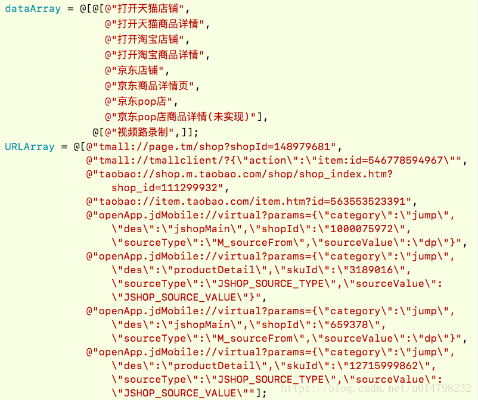

### H5唤起天猫App(原文地址：https://blog.csdn.net/u014798232/article/details/79734354)
详情页分享到支付宝好友，在支付宝好友中打开，点击出现页面的三个点按钮，在出现的菜单中点击复制链接，此链接中的id参数即为商品id
```
<a href="tmall://page.tm/shop?shopId=148979681">去天猫</a>
<a href='tmall://tmallclient/?{\"action\":\"item:id=546778594967\"'>去详情</a>
```

```
@"tmall://page.tm/shop?shopId=148979681",  (店铺id)
@"tmall://tmallclient/?{\"action\":\"item:id=546778594967\"",  (商品id)
@"taobao://shop.m.taobao.com/shop/shop_index.htm?shop_id=111299932",
@"taobao://item.taobao.com/item.htm?id=563553523391",
@"openApp.jdMobile://virtual?params={\"category\":\"jump\",\"des\":\"jshopMain\",\"shopId\":\"1000075972\",\"sourceType\":\"M_sourceFrom\",\"sourceValue\":\"dp\"}",   (店铺id)
@"openApp.jdMobile://virtual?params={\"category\":\"jump\",\"des\":\"productDetail\",\"skuId\":\"3189016\",\"sourceType\":\"JSHOP_SOURCE_TYPE\",\"sourceValue\":\"JSHOP_SOURCE_VALUE\"}",  (商品id)
@"openApp.jdMobile://virtual?params={\"category\":\"jump\",\"des\":\"jshopMain\",\"shopId\":\"659378\",\"sourceType\":\"M_sourceFrom\",\"sourceValue\":\"dp\"}"
```

