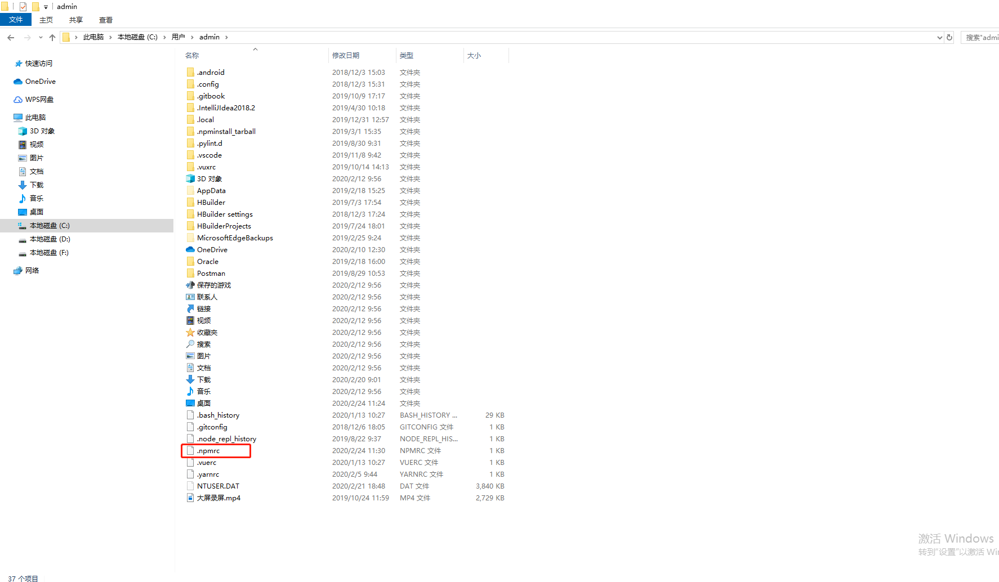

### npm设置和查看仓库源
- 设置和查看npm的源,可以设置多个源，但是只有一个是生效的

```
//设置淘宝源
npm config set registry https://registry.npm.taobao.org

//设置公司的源
npm config set registry http://127.0.0.1:4873

//查看源，可以看到设置过的所有的源
npm config get registry
```
以上功能yarn同理 

- 修改npm配置文件

```
// 编辑 ~/.npmrc 加入下面内容
registry = https://registry.npm.taobao.org
```
- 使用cnpm命令代替npm

```
// 安装cnpm命令,不会改变npm的源
npm install -g cnpm --registry=https://registry.npm.taobao.org

//使用
cnpm install
```
- 临时使用

```
//本次从淘宝仓库源下载
npm --registry=https://registry.npm.taobao.org install
```
- 查看本地包的缓存地址

```
npm config get cache
```

- .npmrc文件地址

