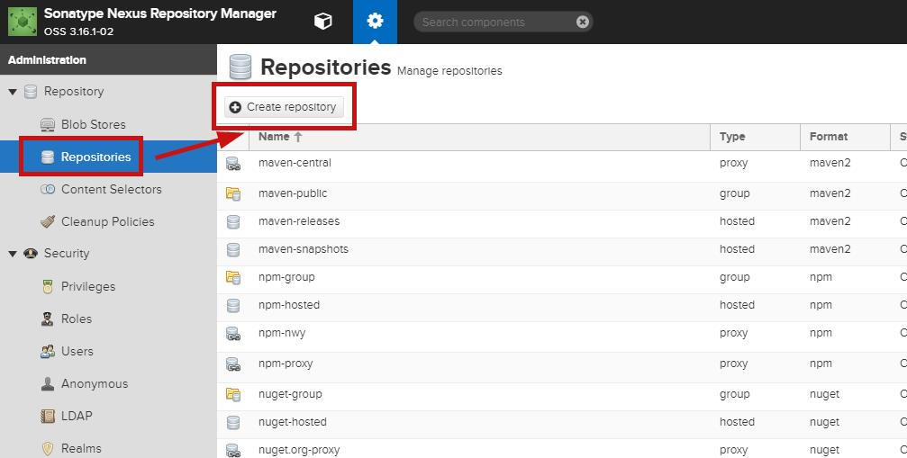
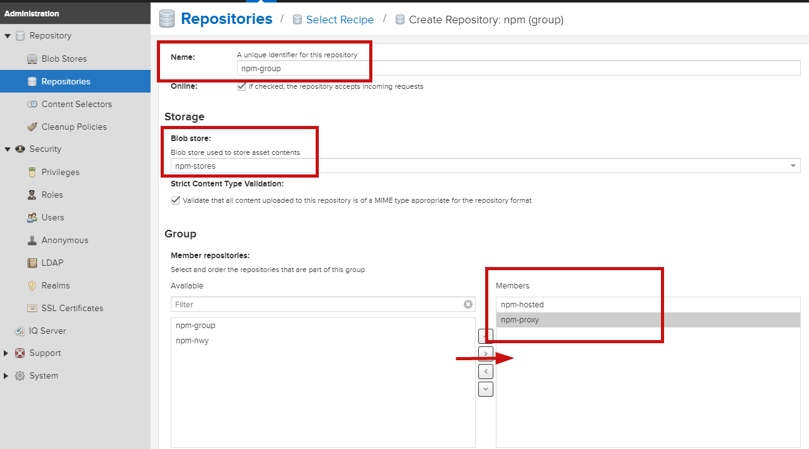

### nexus设置npm下载管理

#### 第一步 登录私服网页


####  第二步 创建存储空间（如果使用默认的存储空间，此步骤可省略）


####  第三步 输入空间的名称，点击create创建


####  第四步 创建仓库



npm的仓库有三种：


```
这三种分别是：
hosted（私有仓库）：用于发布个人开发的npm组件
proxy（代理仓库）：可以代理npm和淘宝镜像
group（组合仓库）：对外公开的仓库，集合了hosted和proxy
```

1. 创建 Hosted npm Registries


输入仓库名称，存储空间选择刚刚创建的，也可以用默认的。点击create创建。

2. 创建 Proxy npm Registries


输入仓库名称，选择存储空间，代理的远程地址可以写https://registry.npmjs.org，也可以写淘宝镜像。点击create创建

3. 创建Group npm Registries仓库组



组合仓库中除了输入名称和选择存储空间之外，还要选择要包括的仓库，越靠上优先级越高，如果私有仓库在上，用户下载npm包的时候会优先下载私有仓库中的，如果私有仓库没有再去代理仓库中下载。

#### 第五步，创建用户，设置权限（用于发布npm包）


然后是设置权限，这一步如果不设置，是不能发布自己的npm包的。


#### 第六步，用户端使用私服

复制出group仓库的链接地址


然后，用户端设置registry

1. 从私服安装npm包

1.1 设置npm下载registry（私服下载包优先级为：本地库-》淘宝镜像-》npm）

方法一,命令行执行：

npm config set registry http://test.radonline.cn:8010/repository/npm-group/

方法二：

修改C:\Users\Administrator下的.npmrc文件，修改为：

registry=http://test.radonline.cn:8010/repository/npm-group/

1.2 安装依赖，命令行执行

npm install

2. 发布私有包到私服

2.1 登陆私服,命令行执行：

npm login –registry=http://test.radonline.cn:8010/repository/npm-hosted/

2.2 输入账号、密码、邮箱

账号：admin  密码：hmgsoft

2.3 发布包，命令行执行：

npm publish


