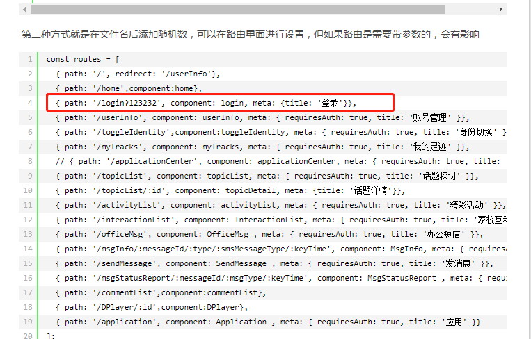

### 2020-12

#### 2020-12-14

- vue引用警告 "export 'default' (imported as 'xx') was not found in './xx'处理方法：
```
// 1. 修改引用
import * as Index_Utils from './api/index'

// 2. 修改'./api/index'文件中的module.export为export default
```

#### 2020-12-15

- 循环渲染中绑定数组的一个值，用v-if始终出不来换成:style="paneItem.message?'display:block;':'display:none;'" 就出来了
- 判断一个表达式值（a）得true/false,a为true时!a为true，a为false时!a也为true，解决办法：将表达式赋值给一个变量，判断变量的true、false就对了
- 手机端页面在左侧顶部莫名其妙出现一个像素的块儿，经查是因为此块元素使用了样式overflow:scroll;换成overflow:auto;解决
- 微信公众号内图标消失，检查是项目替换图标改微信缓存导致无法正确加载图标，
- 微信公众号内vue页面缓存导致更新无法最新反应页面更改，解决办法在路由里加版本号参数

- html2canvas配置图图片跨域后打印时图片仍出不来，在img标签中设置crossorigin="anonymous"
- 要触发浏览器的copy命令必须是button标签
- 依赖外部传入props渲染的页面，在mounted内用nextTick内取不到渲染完毕的元素，在此props变量的监听中用nextTick才能取到渲染完毕的元素
- promise对象中return false;并不会走到then中但是直接return false;会走到then中（http.js处理取消请求控制台报错的解决办法直接return new Promise(),在内部return false;）
- Uncaught SyntaxError: Unexpected token <：可能是某个js未正确加载成功，或script标签加载html文件，或调用未定义的方法

#### 2020-12-23

1. call()、apply()、bind()都是用来重新定义this对象的，bind返回是一个新的函数，必须调用才会执行，如：bind(xx)();
call、apply、bind的第一位参数都是绑定的this对象，从第二个参数开始不同；call传参：','号分隔的参数列表；apply传参：数组；bind：','号分隔的参数列表或数组
